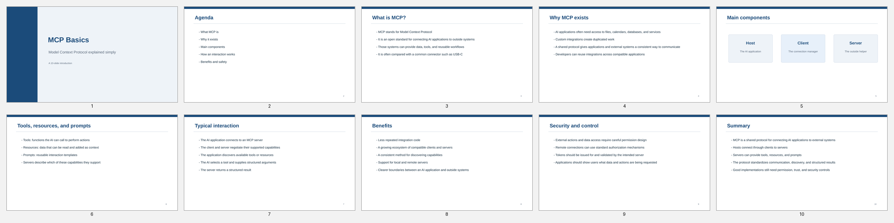
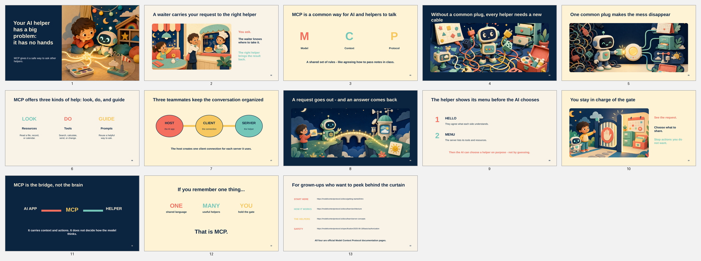
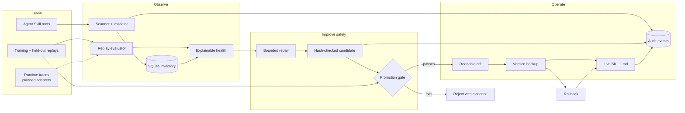

# Skillkeeper

[](https://github.com/jyotipravatiitm/skillkeeper/actions/workflows/ci.yml)
[](https://www.python.org/downloads/)
[](LICENSE)

**Keep every Agent Skill observable, testable, and reversible.**

Skillkeeper is a local-first control plane for the skills your AI agents depend on. It scans open `SKILL.md` packages, measures explicit replay requirements, stages bounded repairs, validates them against held-out cases, and keeps promotion and rollback auditable.

> Healing creates a candidate. It never silently edits the live skill.

## Why it exists

Agent runtimes execute skills. Registries help you find them. Optimizers can rewrite them. Skillkeeper answers the operational questions around the whole inventory:

- Which skills are invalid, untested, duplicated, or unhealthy?
- What repeatable evidence shows that a skill is failing?
- Does a proposed change improve training cases and still pass unseen cases?
- What exact version was evaluated and promoted?
- Can I inspect the diff and restore the previous version immediately?

Skillkeeper follows the open [Agent Skills](https://agentskills.io/specification) folder format. It does not introduce a replacement for `SKILL.md`.

## See the improvement lifecycle

The included presentation demo starts with a generic, text-heavy deck skill and adds an evidence-backed quality contract. The deck artifacts make the before/after change easy to inspect.

| Before | After |
|---|---|
| [](demo/decks/mcp-like-five-before.pdf) | [](demo/decks/mcp-like-five-after.pdf) |

Open the [before PDF](demo/decks/mcp-like-five-before.pdf), [after PDF](demo/decks/mcp-like-five-after.pdf), or editable [before](demo/decks/mcp-like-five-before.pptx) and [after](demo/decks/mcp-like-five-after.pptx) PowerPoint files. The [demo report](demo/README.md) contains the evaluation receipts and the honest boundary of the result.

## Install

### From this repository

```bash
git clone https://github.com/jyotipravatiitm/skillkeeper.git
cd skillkeeper
python3 -m venv .venv
source .venv/bin/activate
python -m pip install -e .
skillkeeper --help
```

The runtime has no third-party Python dependencies. Python 3.10 or newer is required.

### Install directly from GitHub

With [`uv`](https://docs.astral.sh/uv/):

```bash
uv tool install git+https://github.com/jyotipravatiitm/skillkeeper.git
skillkeeper --help
```

## Five-minute quick start

Use the included presentation fixture so your real skills remain untouched:

```bash
export SKILLKEEPER_STATE="$PWD/.skillkeeper-demo"

skillkeeper --state-dir "$SKILLKEEPER_STATE" scan \
  examples/presentation-skill

skillkeeper --state-dir "$SKILLKEEPER_STATE" health \
  examples/presentation-skill/before \
  examples/presentation-skill/replays
```

Create and validate a repair candidate:

```bash
skillkeeper --state-dir "$SKILLKEEPER_STATE" heal \
  examples/presentation-skill/before \
  --train \
    examples/presentation-skill/replays/01-investor-pitch.train.json \
    examples/presentation-skill/replays/02-product-review.train.json \
  --holdout \
    examples/presentation-skill/replays/03-board-update.holdout.json
```

The result includes a candidate ID. Inspect it without touching the live fixture:

```bash
skillkeeper --state-dir "$SKILLKEEPER_STATE" diff CANDIDATE_ID
skillkeeper --state-dir "$SKILLKEEPER_STATE" events --limit 20
```

Promotion is always explicit:

```bash
skillkeeper --state-dir "$SKILLKEEPER_STATE" promote CANDIDATE_ID
```

The promotion result contains the backup path required by `rollback`.

## Architecture



## Commands

| Command | Purpose |
|---|---|
| `scan` | Discover skills, validate packages, and index dependencies |
| `inventory` | Show the indexed inventory |
| `evaluate` | Run explicit replay requirements against one skill |
| `health` | Explain package validity, replay coverage, and pass rate |
| `heal` | Create and gate a staged candidate |
| `diff` | Show the exact candidate change |
| `promote` | Promote a passing, untampered candidate |
| `rollback` | Restore a named backup |
| `events` | Inspect the local audit trail |

Run `skillkeeper COMMAND --help` for command-specific arguments.

## Safety model

- State is local in SQLite and ordinary files.
- Candidate generation writes to `.skillkeeper/staging`, never directly to a live skill.
- Training improvement and a held-out threshold are both required.
- Promotion verifies that neither the live baseline nor staged candidate changed after evaluation.
- Every promotion creates a complete rollback copy first.
- Scan, candidate, promotion, and rollback events are recorded.

Keep the state directory outside any scanned skill root.

## What v0 proves—and what it does not

The current evaluator verifies explicit textual skill contracts deterministically. That is sufficient to prove the staging, evidence, promotion, tamper-checking, audit, and rollback lifecycle.

It does **not** claim that keyword checks measure arbitrary agent quality or presentation taste. Behavioral trace adapters, artifact verifiers, and the terminal **Quality Pulse** are the next product layer. See [The first 10 minutes](docs/FIRST_10_MINUTES.md) for the activation design and [Roadmap](docs/ROADMAP.md) for implementation order.

## Documentation

- [Demo and receipts](demo/README.md)
- [First 10 minutes and Quality Pulse](docs/FIRST_10_MINUTES.md)
- [Open-source GTM](docs/GTM.md)
- [Roadmap](docs/ROADMAP.md)
- [Contributing](CONTRIBUTING.md)
- [Security](SECURITY.md)

## Contributing

The most valuable contributions are real, sanitized failure fixtures, deterministic verifiers, skill-root detectors, and runtime adapters. Start with [CONTRIBUTING.md](CONTRIBUTING.md) and open an issue before building a large adapter.

## License

Apache-2.0. See [LICENSE](LICENSE).
