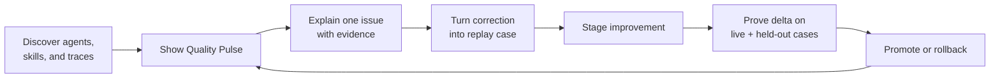

# Skillkeeper: the first 10 minutes

> **Activation promise:** In under 10 minutes, show a solo operator which AI worker needs attention, why, and the safest next action.

The ideal early user runs a one-person company with several agents performing content, sales, research, support, operations, or engineering work. They do not want another agent dashboard. They want confidence that the business work delegated to agents is getting better rather than quietly degrading.

## Product decision

The first magic moment should be a terminal **Quality Pulse** built from the user's actual agent history:

> “Skillkeeper found a recurring source of rework in one of my agents, showed the evidence, and turned it into a test.”

A colorful score by itself is not magic. The score becomes valuable when it produces a specific, credible observation and an immediate action.

The product loop is:



## The terminal moment

Target first-run flow:

```bash
uvx skillkeeper init
```

```text
Skillkeeper found your AI workforce

  Runtimes       Claude Code, Codex
  Agent scopes   4 projects
  Skills         23 unique · 29 installed copies
  History        186 runs in the last 30 days
  Privacy        local analysis · raw transcripts will not be stored

QUALITY PULSE — LAST 30 DAYS

Agent / workflow       Runs  Verified  Rework  Tool reliability  Trend  Confidence
Content agent            31       84%     13%              97%    ↑ 8       High
Research agent           46       91%      7%              94%    →         High
Presentation agent       14       64%     36%              98%    ↓ 12      Medium
Customer support          3       67%     33%              89%    —          Low

Needs attention
presentation-generation was followed by a correction in 5 of 14 runs.
Its SKILL.md changed after 3 of those runs. The recurring issue was visual density.

Evidence: 5 corrections · 3 post-run edits · 2 failed artifact checks

[Enter] inspect evidence   [R] create replay   [P] privacy details
```

The numbers above are illustrative UX, not current Skillkeeper output.

## What “quality” should mean

Do not collapse every available signal into one mysterious score. Separate the business outcome from the operational signals and show confidence.

### Headline metric: verified outcome rate

```text
verified passes / verified outcomes
```

A verified outcome can come from:

- deterministic tests or commands;
- an artifact contract, such as required files, pages, fields, or export format;
- a business-system state, such as published, delivered, reconciled, or resolved;
- explicit user acceptance;
- a user-authored rubric where deterministic verification is not possible.

Do not count “the agent stopped” or “the user did not complain” as a verified pass.

### Supporting metrics

| Metric | Calculation | Meaning |
|---|---|---|
| Rework rate | runs followed by an explicit correction, redo, or reverted output / attributable runs | How often the operator had to intervene |
| First-pass acceptance | accepted outputs without a corrective turn / accepted outputs | How often the agent was useful immediately |
| Tool reliability | successful relevant tool calls / completed relevant tool calls | Whether execution was mechanically reliable |
| Cost per accepted outcome | tokens or estimated cost / accepted outcomes | Efficiency after quality is preserved |
| Median time to accepted outcome | elapsed time from task start to acceptance | Operational speed |
| Replay coverage | current-version requirements exercised / important requirements | How much confidence the tests justify |
| Post-run skill edit rate | runs followed by a related skill edit / attributable runs | A maintenance signal, not proof of failure |
| Drift | distinct hashes of the same skill across active clients | Whether agents are running different procedures |

Keep cost and latency out of the quality score. A fast bad outcome is not high quality.

### Confidence

Every metric should show evidence strength:

- **High:** at least 20 attributable runs and direct outcome verifiers.
- **Medium:** 5–19 attributable runs or a mix of direct and behavioral signals.
- **Low:** fewer than 5 runs, weak skill attribution, or proxy-only evidence.

Use a conservative interval or lower-bound estimate so one successful run never displays as a confident 100%.

## Signal hierarchy

### Tier A: objective enough for scoring

- test, command, or verifier pass/fail;
- explicit task completion state;
- expected artifact exists and passes its contract;
- explicit user accept/reject action;
- downstream business event succeeded or failed;
- rollback or revert tied to the run.

### Tier B: diagnostic evidence

- explicit user correction or “redo” instruction;
- repeated attempt at the same tool or artifact;
- user interruption;
- tool failure or permission denial;
- skill edit shortly after an attributed run;
- candidate promoted or rolled back after a run cluster.

Tier B signals should explain where to look. They should not silently become ground truth.

### Tier C: context only

- tokens, latency, tool count, or number of turns;
- lack of a correction;
- sentiment inferred from ordinary conversation;
- a model judge without a user-authored rubric.

## How trace ingestion can work

Use two complementary adapters:

1. **Retrospective importer:** read existing session metadata and traces locally to create the first Quality Pulse.
2. **Forward event adapter:** install documented runtime hooks so future measurements are stable and attribution improves.

### Runtime feasibility

| Runtime | Useful current surface | Feasibility | Boundary |
|---|---|---:|---|
| Claude Code | Official hooks expose session ID, transcript path, tool success/failure, tool input/result, and duration. Some transcript versions also expose skill-attribution fields. | High | Prefer documented hooks for the durable adapter; treat transcript-only fields as versioned import behavior |
| Hermes | The official session database records session metadata, messages, tools, token counts, timestamps, model, source, and working directory; official exports support redacted trace JSONL. | High | Use a read-only DB/export adapter and default to redaction |
| OpenClaw | Official hooks cover command, message, session, and gateway lifecycle events; the command logger writes JSONL. | Medium | Rich per-skill outcome attribution may require an OpenClaw plugin or additional event support |
| Codex | Local rollout JSONL provides turn, tool, duration, token, and completion events. Current upstream work shows skill-specific lifecycle hooks are still an active gap. | Medium / experimental | Version the importer, never rely on private reasoning, and label implicit skill attribution confidence |

### Privacy modes

The first run must ask once and explain the tradeoff:

1. **Metadata only — default:** durations, counts, exit state, hashes, tool names, and explicit runtime attribution. No message text.
2. **Local semantic analysis — opt in:** inspect user corrections and artifact context on-device, then retain only derived evidence and bounded excerpts approved by the user.
3. **Provider-assisted analysis — separate opt in:** send explicitly selected, redacted runs to a chosen model. Never make this necessary for inventory or deterministic health.

Raw transcripts remain where the runtime stored them. Skillkeeper stores source pointers, event IDs, hashes, derived counters, verifier results, and approved excerpts.

## The first five usages

Each usage should deliver a different kind of value while deepening the evidence loop.

### Usage 1: “It found my AI workforce”

`skillkeeper init`

- Detect installed runtimes, projects, skill roots, duplicate installations, and available history.
- Show an agent/skill map without configuration.
- Reveal one immediate structural issue: invalid package, duplicate name, untested skill, or drifted copy.

Magic moment: **“I did not realize six agents were using three different versions of the same skill.”**

### Usage 2: “It found where I am doing the agent's work”

`skillkeeper pulse --since 30d`

- Rank workflows by verified outcome, correction burden, tool reliability, and confidence.
- Highlight one high-confidence rework cluster.
- Avoid generic advice; link every observation to evidence.

Magic moment: **“My research agent is not the problem—the handoff skill causes most of the rework.”**

### Usage 3: “It explained the failure”

`skillkeeper inspect presentation-generation`

- Show the run sequence, activated skill version, failed check, user correction, and subsequent skill edit.
- Compare the failing cluster with successful runs.
- Let the user mark attribution correct, wrong, or uncertain.

Magic moment: **“The same instruction is missing in four failures, and I can see the receipts.”**

### Usage 4: “My correction became a permanent test”

`skillkeeper case create --from-run RUN_ID`

- Draft a sanitized replay case from the selected failure.
- Ask the user to choose the observable success condition.
- Run it against the current skill and record the baseline.

Magic moment: **“The correction I keep repeating is now a regression test.”**

### Usage 5: “It improved safely and proved it”

`skillkeeper heal presentation-generation`

- Generate a bounded candidate in staging.
- Show before, after, held-out score, cost, readable diff, and confidence.
- Require explicit promotion and create a rollback point.
- After several new runs, compare the candidate cohort with the old version.

Magic moment: **“The fix reduced rework, and I can undo it in one command.”**

## Other high-value magic moments

These can follow the first activation loop:

### The hidden-cost receipt

“Your support agent used 42% more tokens this week because it retried the same browser step in nine sessions.”

Only show this after grouping comparable tasks and preserving outcome quality.

### The business-at-risk warning

“The invoice agent ran 63 times this month, but its current skill hash has no replay coverage.”

This combines usage and governance without pretending the untested skill is broken.

### The drift reveal

“Your Codex project and Claude project use different versions of `customer-reply`; the weaker copy generated four of the five corrected replies.”

### The improvement ledger

“Three user corrections became tests this month. Two skill changes were promoted; one was rejected by a held-out case.”

### The Monday operator brief

```text
Your AI workforce this week

✓ 118 accepted outcomes
↑ Content rework: 18% → 9%
↓ Support tool reliability: 97% → 89%
! 2 high-usage skills changed without fresh replay evidence

Recommended action: inspect support-browser before its next scheduled run.
```

## Business-agent templates

Generic metrics are not enough for a one-person company. During the first replay creation, offer outcome templates:

| Agent role | Useful objective outcomes |
|---|---|
| Content | artifact contract passes, visual QA, approved without revision, published state |
| Research | source coverage, unsupported-claim count, freshness, accepted brief |
| Sales | required CRM fields, personalization checks, reply/meeting state, correction rate |
| Support | resolved/reopened/escalated state, policy compliance, response correction |
| Finance | reconciliation pass, schema validation, exception count, human approval |
| Operations | workflow completion, failed integrations, rollback, time to resolution |
| Engineering | tests, lint, review findings, reverted changes, CI state |

The user should define what “good” means for the business. Skillkeeper should collect and explain the evidence.

## MVP build order

### Phase 1: first 10-minute pulse

1. `init` with runtime, root, and trace discovery.
2. Privacy selector and metadata-only import.
3. Claude Code and Hermes adapters first; experimental Codex importer second.
4. Terminal Quality Pulse with confidence and evidence counts.
5. Drift, package validity, tool failure, duration, and usage metrics.

### Phase 2: corrections become tests

1. Local correction/retry detection with explicit user confirmation.
2. `inspect` evidence view.
3. `case create --from-run` and role-specific verifier templates.
4. Current-version baseline and replay history.

### Phase 3: closed improvement loop

1. Staged candidate generation.
2. Behavioral and artifact replay adapters.
3. Held-out and cross-skill regression gates.
4. Promotion, canary comparison, and rollback.

## Activation metrics

Track the funnel rather than only stars:

```text
install
  → runtime and skills discovered
  → Quality Pulse displayed
  → evidence item inspected
  → first replay case accepted
  → first candidate evaluated
  → user returns for second pulse
```

Targets for design partners:

- median install-to-pulse under 10 minutes;
- at least 70% of installs discover one usable runtime or skill root;
- at least 50% of pulses contain one evidence-backed insight;
- at least 30% of users inspect an evidence item;
- at least 20% create one replay case in the first week;
- at least 40% return for a second pulse within 14 days.

## Product boundary

Agent outcome quality is produced by the task, model, tools, context, runtime, and skills together. Skillkeeper should not blame a skill merely because it was present. Every diagnosis needs an attribution confidence and must allow the user to correct it.

The trustworthy promise is not “we know your agent's true quality.” It is:

> We turn the strongest evidence already present in your agent work into an explainable quality view, reusable tests, and safer improvements.

## Primary technical sources

- [Claude Code hooks reference](https://code.claude.com/docs/en/hooks) documents tool success/failure, transcript path, duration, session lifecycle, and task events.
- [Hermes session documentation](https://hermes-agent.nousresearch.com/docs/user-guide/sessions/) documents its local session database, token and tool metadata, trace export, and redaction.
- [Hermes skills documentation](https://hermes-agent.nousresearch.com/docs/user-guide/features/skills) describes creation or modification after complex tasks, errors, and user corrections.
- [OpenClaw hooks documentation](https://docs.openclaw.ai/automation/hooks) documents command, session, message, and lifecycle hook surfaces.
- [Codex skill-hook request](https://github.com/openai/codex/issues/17132) shows why Codex skill attribution should be treated as experimental until a stable skill lifecycle hook exists.
