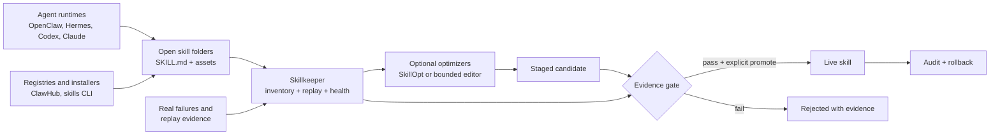

# Skillkeeper open-source GTM

> **Category:** SkillOps for Agent Skills
> **One-line pitch:** Skillkeeper is Git, tests, and a safety gate for the skills your AI agents depend on.
> **Launch promise:** Know which skills are healthy, prove a change helps, and roll it back when it does not.

This document is the public-launch plan for turning the current local prototype into a focused open-source project. It includes the market read, positioning, developer experience, launch sequence, community loop, and ready-to-adapt social copy.

The detailed activation experience, trace feasibility, objective metrics, and first-five-usage journey are in [`FIRST_10_MINUTES.md`](FIRST_10_MINUTES.md).

## Executive decision

Do not launch Skillkeeper as “an agent that improves its own skills.” Hermes Agent already makes self-improvement a core product claim, OpenClaw has a reviewed Skill Workshop, and SkillOpt directly optimizes skills using validation-gated training.

Launch it as the neutral **quality and release control plane for an entire Agent Skills inventory**:

> Skill registries help you find skills. Agent runtimes execute them. Optimizers rewrite them. Skillkeeper tells you what is healthy, tests proposed changes, and keeps every promotion reversible.

The best initial wedge is **observability and safety**. It applies to every skill, does not require a particular model, and produces trust before asking users to permit self-modification. Improvement is the compelling second act and the best demo, but it should always run through replay evidence, staging, explicit promotion, and rollback.

## What the open-source leaders teach us

GitHub stars below are a discovery signal, not a quality ranking. Counts are a GitHub API snapshot from 2026-07-28 and will change.

| Project | Snapshot | What users value | Lesson for Skillkeeper |
|---|---:|---|---|
| [OpenClaw](https://github.com/openclaw/openclaw) | 384k stars | A complete personal-agent runtime, multiple skill roots, ClawHub installation, trust verification, allowlists, and a reviewed Skill Workshop | Integrate with its roots and evidence; do not build another runtime or registry |
| [Superpowers](https://github.com/obra/superpowers) | 262k | Opinionated workflows that visibly change how coding agents work, with installation across many harnesses | Lead with a dramatic workflow outcome, not infrastructure vocabulary |
| [Hermes Agent](https://github.com/NousResearch/hermes-agent) | 222k | A self-improving agent, one-command install, skills learned from use, migration, `doctor`, and many user surfaces | “Self-improving” is not unique; one-command onboarding and diagnosis are table stakes |
| [Anthropic Skills](https://github.com/anthropics/skills) | 165k | Canonical examples, a simple `SKILL.md` mental model, and marketplace/plugin installation | Remain compatible with the open folder format and make the first example excellent |
| [VoltAgent awesome-agent-skills](https://github.com/VoltAgent/awesome-agent-skills) | 29k | A large, cross-agent discovery catalog | Discovery is crowded; health evidence is the opening |
| [Vercel skills CLI](https://github.com/vercel-labs/skills) | 27k | One command, Git/local sources, project or global scope, canonical symlinks, update/remove/init, and support for many agents | Users expect automatic root detection and a single canonical copy |
| [Agent Skills specification](https://github.com/agentskills/agentskills) | 24k | A small interoperable standard: a folder, `SKILL.md`, metadata, instructions, scripts, references, and assets | Build on the standard; do not invent a replacement manifest |
| [Microsoft SkillOpt](https://github.com/microsoft/SkillOpt) | 15k | Reproducible text-space optimization, scored rollouts, bounded edits, validation gates, multiple backends, and a dashboard | Treat it as an optional optimizer backend; Skillkeeper owns portfolio health and release policy |

### The unoccupied product space

The projects above cover execution, distribution, authored workflow packs, and single-skill optimization. The opening is a cross-runtime layer that can answer:

- Which local and project skills exist across Codex, Claude Code, OpenClaw, Hermes, Cursor, and Copilot?
- Which copies have drifted?
- Which skills are invalid, stale, overlapping, untested, or associated with corrections?
- What replay evidence proves a candidate is better than the live version?
- Did improving one skill regress a sibling workflow?
- Who promoted the change, what hash was evaluated, and how do we roll it back?

OpenClaw's trust envelope answers “is this the expected registry artifact?” Skillkeeper should answer the complementary question: “does this version still work for **my** tasks?”



## Positioning

### Category

Use **SkillOps** consistently, then explain it in plain language:

> CI/CD and observability for Agent Skills.

### Primary message

**Keep every agent skill observable, testable, and reversible.**

### Supporting messages

- One inventory across agent clients.
- Replay real tasks before accepting a rewrite.
- Healing creates a candidate; it never silently edits the live skill.
- Local-first evidence, explicit promotion, immediate rollback.
- Open Agent Skills folders in, ordinary Agent Skills folders out.

### What not to say

- “Autonomous self-healing for any agent.” The current evaluator proves deterministic contract improvement, not arbitrary behavioral quality.
- “The first self-improving skill system.” Hermes and SkillOpt make adjacent claims.
- “Secure skills.” Package validation and hash checks are useful, but they are not a complete malware or sandboxing system.
- “Production ready.” The current package is a credible MVP and demo, not yet a hardened multi-user service.

## Ideal users and beachhead

### Primary user

An AI-agent power user or small team with 10–100 user- and project-level skills across two or more clients. They already feel skill sprawl, duplicated copies, unclear regressions, and fear of automatic rewriting.

### Secondary users

- Maintainers of public skill packs who need repeatable acceptance tests.
- Teams committing `.agents/skills`, `.claude/skills`, or `.github/skills` to repositories.
- Agent-runtime maintainers who want a neutral health and replay adapter.
- Skill optimizers that need a safe inventory, promotion, and rollback layer.

### First three use cases

1. **Inventory audit:** scan multiple roots and explain invalid packages, dependencies, content hashes, and missing replay coverage.
2. **Regression gate:** run committed replay cases in local development or CI before a skill change merges.
3. **Safe improvement:** turn a failure into a staged candidate, compare scores and diff, promote explicitly, then demonstrate rollback.

## The launch demo

Use the presentation example because the difference is visible without requiring viewers to understand evaluation infrastructure.

**Story:** “A presentation skill makes a technically correct but dull deck. Skillkeeper records explicit quality requirements, creates a bounded candidate, gates it on training and unseen cases, and produces a visibly better ‘MCP like I am five’ PDF. The live skill remains unchanged until promotion.”

### 45-second screen recording

1. Show the before PDF: crowded, weak hierarchy, little visual storytelling.
2. Run inventory and health; highlight the failed requirements and score.
3. Run `heal`; show that the result is staged, not live.
4. Show the readable diff and held-out result.
5. Show the after PDF beside the before PDF.
6. Promote the candidate, show the audit event, then run rollback.
7. End card: **“Git + CI for the skills your agents depend on.”**

The demo must visibly label deterministic checks versus subjective visual judgment. Later, a rendered-artifact verifier can make the visual evaluation part of the actual gate.

## Make it easy to use

### Current path from this checkout

The existing MVP is dependency-free at runtime and already supports scan, inventory, replay evaluation, health, staged healing, diff, explicit promotion, rollback, and audit events:

```bash
python3 -m venv .venv
source .venv/bin/activate
python -m pip install -e .
skillkeeper --help
```

That proves installability, but it is too many decisions for a public first run. The target public experience should be:

```bash
# Install once PyPI publishing is complete
uv tool install skillkeeper

# Detect supported skill roots, create local state, and explain findings
skillkeeper init

# Get value immediately
skillkeeper doctor
skillkeeper scan
skillkeeper demo presentation
```

The package name `skillkeeper` was unclaimed on PyPI at the 2026-07-28 check. Recheck immediately before publishing. GitHub already has several small projects named SkillKeeper, including [one adjacent skill manager](https://github.com/lorem-dev/skillkeeper), so the README and social launch must consistently pair the name with the distinct **SkillOps** category and the “observable, testable, reversible” promise.

### P0: required before the public launch

1. **Done — standalone repository.** The public repository contains only the package, tests, examples, documentation, and launch assets.
2. **Done — public name and license.** The CLI and repository use `skillkeeper`; the project is Apache-2.0.
3. **Publish a signed release and PyPI package.** Support `uv tool install skillkeeper` and `pipx install skillkeeper`; do not make cloning the repo the normal install path.
4. **Add `skillkeeper init`.** Auto-detect `.agents/skills`, `.claude/skills`, `.github/skills`, `.cursor/skills`, configured Codex roots, `~/.openclaw/skills`, and `~/.hermes/skills`. Preview every root before writing config.
5. **Add `skillkeeper doctor`.** Check Python/version, database writability, roots, invalid `SKILL.md` files, replay coverage, and unsafe state placement. Print concrete fixes.
6. **Add a one-command demo.** It must operate on a disposable copied fixture and leave the user's live skills untouched.
7. **Make terminal output human-readable.** Default to compact tables and explanations; retain `--json` for scripts.
8. **Partly done — CI is included.** It tests Python 3.10 and 3.13 on macOS, Linux, and Windows. Add signed release and PyPI automation after the first public validation cycle.

### P1: turn first use into recurring use

- `skillkeeper check --all` with a non-zero exit code for CI.
- A GitHub Action for skill package validation and replay gates.
- `skillkeeper case add <skill>` to turn a correction into a replay fixture interactively.
- `skillkeeper watch` to detect changed skill hashes and stale evaluations.
- HTML report or local dashboard showing health dimensions and evidence, not one opaque score.
- Importers for OpenClaw and Hermes roots plus a generic JSONL execution-event adapter.
- Pre-commit hook for fast package and reference checks.

### P2: ecosystem expansion

- SkillOpt adapter for validation-gated candidate generation.
- Runtime adapters for behavioral replay in Codex, Claude Code, OpenClaw, and Hermes.
- Cross-skill regression selection using the dependency graph.
- Canary promotion policies for deterministic, low-risk skills.
- Signed evidence bundles and team review policies.

## GitHub repository checklist

The launch repository should have:

- A README with the one-line outcome, a 10-second GIF, three-command quick start, architecture, supported roots, safety boundary, and current limitations.
- `LICENSE`, `CONTRIBUTING.md`, `SECURITY.md`, `CODE_OF_CONDUCT.md`, and a short roadmap.
- Green CI, install smoke tests, a tagged release, changelog, and reproducible demo fixtures.
- GitHub issue forms for bug, adapter request, and replay-verifier request.
- Labels such as `good first issue`, `adapter`, `verifier`, `runtime`, `docs`, and `needs-replay`.
- Topics: `agent-skills`, `ai-agents`, `llm`, `skillops`, `agent-observability`, `codex`, `claude-code`, `openclaw`, `hermes-agent`.
- A public boundary table: implemented, experimental, planned, and explicitly not supported.

### Suggested README opening

```markdown
# Skillkeeper

**Keep every Agent Skill observable, testable, and reversible.**

Skillkeeper scans skills across your agent clients, runs replay checks, stages
bounded improvements, and gives you an explicit promotion and rollback path.
Your live `SKILL.md` is never silently rewritten.


```

## Distribution strategy

### Win developers first

1. Publish the repository and PyPI release with the full before/after demo.
2. Post a Show HN focused on the problem and working artifact, not market language.
3. Share in the OpenClaw, Hermes, Agent Skills, Codex, and Claude Code communities with a concrete integration guide. Follow each community's promotion rules.
4. Submit small compatibility or documentation PRs where welcome; demonstrate that Skillkeeper complements rather than replaces each runtime.
5. Add the project to relevant Agent Skills and agent tooling lists after the install path is stable.

### Build an integration flywheel

Each new runtime or verifier should create four assets:

- an adapter;
- a fixture and test;
- a two-minute guide;
- a social demo tagging the relevant ecosystem.

This turns contribution work into distribution without manufacturing generic launch posts.

### Contribution ladder

Make it possible to contribute in increasing levels of difficulty:

1. Add a real failing replay fixture.
2. Improve a doctor check or error message.
3. Add a skill-root detector.
4. Add a deterministic verifier.
5. Add a runtime event or optimizer adapter.

Publish a monthly “skill failure patterns” report from opt-in, sanitized fixtures—not private transcripts. The useful public dataset and verifier library can become the project's strongest moat.

## Launch sequence

### Week 0: product readiness

- Extract the standalone repository and settle the name/license.
- Add `init`, `doctor`, demo, human-readable output, CI, and PyPI packaging.
- Record the 45-second before/after demo and capture one architecture image.
- Recruit 5–10 design partners with real multi-skill inventories.

### Launch day

- Publish v0.1.0, demo video, and the same honest capability boundary everywhere.
- Open five well-scoped `good first issue` tasks.
- Be present for installation failures; time-to-fix matters more than launch-day stars.
- Ask one question: “What was the first skill failure you wished you could replay?”

### Days 2–30

- Ship fixes in small releases and publish the changelog.
- Turn the first three external failures into public, sanitized replay fixtures.
- Land one OpenClaw or Hermes root adapter and one CI verifier.
- Publish a technical teardown: why staging, held-out cases, content hashes, and rollback matter for self-improving skills.

## Success metrics

The north-star metric is **weekly skill inventories with at least one evidence-backed check**, not GitHub stars.

Track:

- median install-to-first-scan time, target under 5 minutes;
- percentage of installs completing a first scan;
- percentage of scanned inventories adding at least one replay case;
- weekly inventories checked and candidates evaluated;
- promotion and rollback counts, with reasons;
- number of external runtime/verifier adapters;
- external contributors and repeat contributors;
- installation failures by operating system.

Stars, impressions, and followers are useful distribution signals, but they do not prove product activation.

## Ready-to-adapt social copy

Replace `<REPO_URL>` and `<DEMO_URL>` before posting.

### X launch post

> Your agent has 20 skills. Which one is stale? Which one caused the failure? Did an “improvement” break another workflow?
>
> I built Skillkeeper: local-first health, replay tests, staged repairs, explicit promotion, and rollback for Agent Skills.
>
> Git + CI for skills. `<REPO_URL>`

Attach the side-by-side before/after deck and the 45-second demo. A visual result should be the first frame; architecture is the second asset.

### X technical thread outline

1. Agent skills are becoming executable infrastructure, but most are still maintained like loose prompt files.
2. The ecosystem already has excellent runtimes, registries, workflow packs, and optimizers. The missing layer is evidence-backed release control across all of them.
3. Skillkeeper scans the inventory, runs replay cases, creates a candidate in staging, checks held-out cases, and records every event.
4. No silent mutation: promotion is explicit, hash-checked, backed up, and reversible.
5. Demo the “MCP like I am five” presentation skill before and after. Then invite real failure fixtures and adapter contributions.

### LinkedIn launch post

> Agent Skills are turning prompts into reusable software—but we still manage many of them as untested Markdown files.
>
> I built **Skillkeeper**, an open-source, local-first control plane for Agent Skills. It inventories skills across clients, runs replay checks, stages bounded improvements, gates them on held-out cases, and keeps promotion and rollback auditable.
>
> The key design decision: healing creates a candidate. It never silently edits the live skill.
>
> The launch demo uses a presentation skill to create a visually weak “MCP like I am five” deck, diagnose its missing quality contract, and produce a gated before/after result.
>
> I am looking for maintainers and power users with real skill inventories, replay fixtures, and runtime adapters—not generic feedback. Repository: `<REPO_URL>` Demo: `<DEMO_URL>`

### Show HN

**Title:** `Show HN: Skillkeeper – replay tests and rollback for AI agent skills`

**Opening:**

> I use skills across multiple AI coding agents and found that installing or rewriting them was easier than knowing whether they still worked. Skillkeeper is a local-first CLI that scans Agent Skills folders, evaluates explicit replay cases, stages bounded changes, gates candidates on held-out cases, and requires an explicit promotion. It records hashes and backups so changes can be audited or rolled back.
>
> The current v0 evaluator checks deterministic skill contracts; it does not pretend phrase matching can judge arbitrary agent behavior. The next work is behavioral runtime adapters and artifact verifiers. I would especially value real failing fixtures and feedback on the replay format.

## Defensibility and product path

The durable asset is not an LLM prompt that rewrites `SKILL.md`. It is the combination of:

- cross-runtime inventory and event adapters;
- reusable deterministic verifiers;
- sanitized real-world replay fixtures;
- promotion policies and evidence history;
- trust earned by local-first, reversible operation.

The open-source project should make single-user SkillOps excellent. A later commercial layer can offer shared policies, team approval, fleet-wide health, signed releases, and compliance evidence. Do not put the core local replay and rollback loop behind a paid service; that loop is what earns adoption.

## The next ten tasks

1. Decide public name, repository namespace, and license.
2. Extract the working package, six tests, demo skill, and docs into a standalone repository.
3. Publish the package under the final PyPI name.
4. Implement `skillkeeper init` with previewed root auto-detection.
5. Implement `skillkeeper doctor` with actionable fixes.
6. Add human-readable output plus `--json` compatibility.
7. Add a disposable `skillkeeper demo presentation` command.
8. Add cross-platform CI, package smoke tests, and the first tagged release.
9. Record the 45-second before/after video and export the architecture diagram.
10. Onboard five external inventories before the broad social launch.

## Source notes

- The Agent Skills format and activation model come from the [Agent Skills specification](https://agentskills.io/specification).
- OpenClaw loading order, Skill Workshop, ClawHub installation, and verification behavior come from its [official skills documentation](https://github.com/openclaw/openclaw/blob/main/docs/tools/skills.md).
- Hermes installation, learning-loop claims, migration, and `doctor` command come from the [official Hermes repository](https://github.com/NousResearch/hermes-agent).
- Multi-agent installation and canonical symlink behavior come from the [Vercel skills CLI](https://github.com/vercel-labs/skills).
- Skill optimization and validation-gated updates come from the [official SkillOpt repository](https://github.com/microsoft/SkillOpt).
